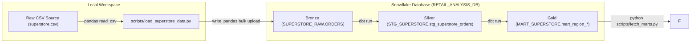

# Superstore Regional Business Performance Pipeline

## Summary

As part of the regional business performance analysis, a modern Medallion data engineering pipeline was established. Raw records are ingested, standardized in a Silver staging layer, and compiled into Gold reporting marts directly in Snowflake using dbt (Data Build Tool) and Python. 

This pipeline automates:
*   **Data Preprocessing & Standardization:** Standardizing column layouts to strict uppercase snake_case, converting text dates, resolving nulls/duplicates, and padding US postal codes to exactly 5 digits.
*   **Snowflake Database Loading:** Streaming raw transactional records into a Snowflake database using the optimized `write_pandas` bulk connector.
*   **Automated Testing:** Enforcing unique, not_null, and accepted values constraints in the staging schema before reporting.
*   **Dimensional Reporting Marts:** Materializing key business metrics (Sales, Profit, Profit Margins, Average Order Values, and rankings) to drive executive decision-making.

---

## 1. Pipeline Architecture

The end-to-end ELT (Extract-Load-Transform) flow follows a three-stage Medallion architecture inside Snowflake:



### Architectural Phases:
1.  **Ingestion (Bronze):** Raw Kaggle dataset (CSV format with 9,994 transactions and 21 columns) is parsed locally using Pandas and loaded as a raw table in `SUPERSTORE_RAW.ORDERS` in Snowflake.
2.  **Transformation & Quality (Silver):** Columns are normalized to uppercase, text dates are cast to dates, postal codes are left-padded with zeroes via `LPAD`, and cryptographic `MD5` surrogate keys are pre-generated.
3.  **Materialization (Gold):** Aggregated metrics are compiled into tables inside `MART_SUPERSTORE` for fast reporting query performance.

---

## 2. Tools and Technologies Used

| Tool / Library | Role in Pipeline |
| :--- | :--- |
| **Python 3.x** | Core ETL logic orchestration, virtual environment runtime, database loading. |
| **Pandas** | Reading raw CSV inputs, column standardization, and structure mapping. |
| **dbt (Data Build Tool)** | Compiling SQL modular views, managing dependency schemas, and executing automated tests. |
| **Snowflake Connector** | Streaming DataFrame records directly to Snowflake stages via the parallel `write_pandas` API. |
| **Snowflake DB** | Cloud data warehouse hosting the Medallion schemas and executing compiled SQL. |
| **python-dotenv** | Managing local database environment variables securely to prevent password leaks. |

---

## 3. Technical Implementation

### Phase A: Data Preprocessing & Snowflake Ingestion
The python data loading script [load_superstore_data.py](file:///c:/Users/DELL/Desktop/data_practice_problems/scripts/load_superstore_data.py) standardizes header formatting, initializes connection configurations from `.env`, validates database schemas, and streams records:

```python
# 1. Standardize column headers in Pandas
df.columns = [c.strip().upper().replace(' ', '_').replace('-', '_') for c in df.columns]

# 2. Get connection credentials and validate using your function
def get_snowflake_connection(config: dict):
    required_keys = ["account", "user", "password", "warehouse", "database", "schema", "role"]
    missing = [k for k in required_keys if not config.get(k)]
    if missing:
        raise ValueError(f"Missing Snowflake config: {missing}")
    return snowflake.connector.connect(**config)

# 3. Stream dataframe using Snowflake write_pandas bulk interface
success, nchunks, nrows, _ = write_pandas(
    conn=conn,
    df=df,
    table_name="ORDERS",
    database=db_name,
    schema="SUPERSTORE_RAW"
)
```

### Phase B: Staging & Leading Zero Fixing (Jinja/SQL)
The staging layer [stg_superstore_orders.sql](file:///c:/Users/DELL/Desktop/data_practice_problems/models/staging/stg_superstore_orders.sql) left-pads postal codes to ensure 5-digit US ZIP validation:

```sql
-- Convert integers to strings and pad left with '0' to ensure valid US zip codes
lpad(cast(postal_code as varchar), 5, '0') as postal_code
```

---

## 4. Analytical SQL Reports (Gold Layer)

We constructed four reporting models inside the `models/marts/` folder, querying the cleaned Silver layer directly:

### Report 1: Sales by Region
*Groups sales volume and percentage contribution of each region to total company sales.*
```sql
with staging as (
    select * from {{ ref('stg_superstore_orders') }}
),
total_sales as (
    select sum(sales) as company_total_sales from staging
),
region_aggregates as (
    select
        region,
        sum(sales) as total_sales,
        count(distinct order_id) as order_count,
        count(distinct customer_id) as customer_count
    from staging
    group by region
)
select
    r.region,
    r.total_sales,
    r.order_count,
    r.customer_count,
    round((r.total_sales / t.company_total_sales) * 100, 2) as sales_contribution_pct
from region_aggregates r
cross join total_sales t
order by total_sales desc;
```

### Report 2: Profit by Region
*Evaluates net profit, margin percentage, and average discount percentages by region.*
```sql
with staging as (
    select * from {{ ref('stg_superstore_orders') }}
)
select
    region,
    sum(sales) as total_sales,
    sum(profit) as total_profit,
    round((sum(profit) / sum(sales)) * 100, 2) as profit_margin_pct,
    round(avg(discount) * 100, 2) as avg_discount_pct
from staging
group by region
order by total_profit desc;
```

### Report 3: Customer Segment Analysis
*Calculates sales volumes, margins, customer counts, and Average Order Value (AOV) across segments.*
```sql
with staging as (
    select * from {{ ref('stg_superstore_orders') }}
)
select
    customer_segment,
    sum(sales) as total_sales,
    sum(profit) as total_profit,
    round((sum(profit) / sum(sales)) * 100, 2) as profit_margin_pct,
    count(distinct order_id) as order_count,
    count(distinct customer_id) as customer_count,
    round(sum(sales) / count(distinct order_id), 2) as average_order_value
from staging
group by customer_segment
order by total_sales desc;
```

### Report 4: Top Performing Region
*Uses window functions (DENSE_RANK) to rank regions by revenue vs. net profit.*
```sql
with regional_metrics as (
    select
        region,
        sum(sales) as total_sales,
        sum(profit) as total_profit,
        round((sum(profit) / sum(sales)) * 100, 2) as profit_margin_pct
    from {{ ref('stg_superstore_orders') }}
    group by region
)
select
    region,
    total_sales,
    total_profit,
    profit_margin_pct,
    dense_rank() over (order by total_sales desc) as sales_rank,
    dense_rank() over (order by total_profit desc) as profit_rank
from regional_metrics
order by sales_rank;
```

---

## 5. Outputs & Business Insights

### 5.1 Local Run-time Ingestion Metrics
*   **Total Raw Rows Processed:** 9,994 transactions
*   **Total Gross Sales Loaded:** $2,297,200.86
*   **Total Net Profit Loaded:** $286,397.02
*   **Global Profit Margin:** 12.47%

### 5.2 SQL Report Tables (Fetched Dynamically from Snowflake)

#### A. Regional Sales & Contribution
| REGION | TOTAL_SALES | ORDER_COUNT | CUSTOMER_COUNT | SALES_CONTRIBUTION_PCT |
| :--- | :---: | :---: | :---: | :---: |
| **West** | $725,457.83 | 1,611 | 686 | 31.58% |
| **East** | $678,781.25 | 1,401 | 674 | 29.55% |
| **Central** | $501,239.75 | 1,175 | 629 | 21.82% |
| **South** | $391,721.83 | 822 | 512 | 17.05% |

#### B. Regional Profitability and Discounting
| REGION | TOTAL_SALES | TOTAL_PROFIT | PROFIT_MARGIN_PCT | AVG_DISCOUNT_PCT |
| :--- | :---: | :---: | :---: | :---: |
| **West** | $725,457.83 | $108,418.44 | **14.94%** | **10.93%** |
| **East** | $678,781.25 | $91,522.54 | 13.48% | 14.54% |
| **South** | $391,721.83 | $46,749.45 | 11.93% | 14.73% |
| **Central** | $501,239.75 | $39,706.20 | **7.92%** | **24.04%** |

#### C. Customer Segment Metrics
| CUSTOMER_SEGMENT | TOTAL_SALES | TOTAL_PROFIT | PROFIT_MARGIN_PCT | ORDER_COUNT | CUSTOMER_COUNT | AVERAGE_ORDER_VALUE |
| :--- | :---: | :---: | :---: | :---: | :---: | :---: |
| **Consumer** | $1,161,401.15 | $134,118.71 | 11.55% | 2,586 | 409 | $449.11 |
| **Corporate** | $706,146.34 | $91,979.11 | 13.03% | 1,514 | 236 | $466.41 |
| **Home Office** | $429,653.17 | $60,298.81 | **14.03%** | 909 | 148 | **$472.67** |

---

